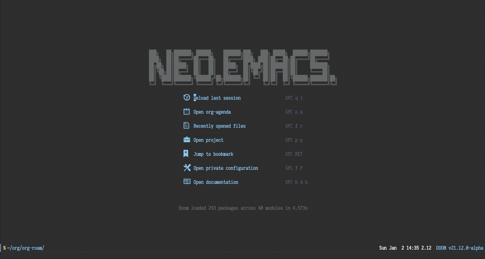

# Table of Contents

1.  [About](#org1a420a5)
2.  [How to install](#orgb0df3ac)
    1.  [Install emacs](#org562208f)
    2.  [Building Emacs](#org9a7716c)
    3.  [Clone doom-emacs](#org81685c8)
    4.  [Clone neo-emacs](#org4a32dc6)
    5.  [Doom Install](#org3db2148)
3.  [Private setting](#org3731bd0)
4.  [Lsp-java Usage](#org54e2186)
5.  [Dap-java Usage](#org5a4bf84)
6.  [Company box customize](#org6486b4b)
7.  [Ejc-sql Usage](#orgb6397d3)
8.  [Rime Usage](#orgf73f5a9)
9.  [Libvterm Usage](#org12e6474)
10. [Questions](#orgbe923be)
    1.  [install ffmpeg](#org4ebb8db)
    2.  [how to install all-the-icons?](#orgb5f5357)
    3.  [how to install rime ?](#org786d76b)
    4.  [how to install vterm?](#orgcba5996)
    5.  [lsp-springboot](#org5086d11)
    6.  [useful key setting](#orga25847b)
11. [Dependencies](#org2c43e87)

# About

Neo emacs is a configuration framework for GNU Emacs which is based on doom emacs and focuses on the java web application coding environment. Neo emacs has the following features:

-   Code completion: Lsp-java supports maven and gradle project.
-   Program debugging: Dap-java supports program debugging.
-   Http client: Rest-client is a tool to manually explore and test HTTP REST webservices just like Postman.
-   SQL client: Ejc-sql turns Emacs into a simple SQL client which supports various databases.
-   Terminal emulator: Emacs-libvterm (vterm) is fully-fledged terminal emulator inside GNU Emacs based on libvterm.
-   Knowledge management system: Org-roam borrows principles from the Zettelkasten method, providing a solution for non-hierarchical note-taking.
-   [onlinedoc](http://1.117.167.195/doc/neo-emacs.html)

# How to install

## Install emacs

Choose your operation system and install it.

-   [gnu-emacs](https://www.gnu.org/software/emacs/) is the official emacs client.
-   [emacs-plus](https://github.com/d12frosted/homebrew-emacs-plus) is the best choice to run NeoEmcas.
-   export EMACS=/Applications/Emacs.app/Contents/MacOS/Emacs, this depends on your installation path.

## Building Emacs

    git clone git://git.savannah.gnu.org/emacs.git
    cd emacs
    git checkout emacs-28
    brew install  libxml2
    make configure
    ./configure --with-native-compilation --with-modern-papirus-icon --with-no-titlebar
    make -j4
    make install
    open nextstep/Emacs.app

## Clone doom-emacs

    git clone https://github.com/hlissner/doom-emacs.git ~/.emacs.d/

## Clone neo-emacs

    git clone https://github.com/vanniuner/neo-emacs.git ~/.doom.d/

## Doom Install

Make sure that you have some setting in your terminal environment.

Set up a vpn if you need it.

    export http_proxy="ip:port"
    export https_proxy="ip:port"

Set your emacs cmd for doom install.

    export EMACS= $YOUR EMACS CMD PATH$

At last run below, this will take few minutes. And it depends on the quality of your network.

    ~/.emacs.doom/bin/doom install

# Private setting

Changing config in the config.el.

<table border="2" cellspacing="0" cellpadding="6" rules="groups" frame="hsides">

<colgroup>
<col  class="org-left" />

<col  class="org-left" />

<col  class="org-left" />
</colgroup>
<tbody>
<tr>
<td class="org-left">rg-exec-path</td>
<td class="org-left">&ldquo;/opt/homebrew/bin/rg&rdquo;</td>
<td class="org-left">rg            exec path</td>
</tr>

<tr>
<td class="org-left">fd-exec-path</td>
<td class="org-left">&ldquo;/opt/homebrew/bin/fd&rdquo;</td>
<td class="org-left">fd            exec path</td>
</tr>

<tr>
<td class="org-left">dot-exec-path</td>
<td class="org-left">&ldquo;/opt/homebrew/bin/dot&rdquo;</td>
<td class="org-left">dot           exec path</td>
</tr>

<tr>
<td class="org-left">lsp-maven-path</td>
<td class="org-left">&ldquo;~/.m2/settings.xml&rdquo;</td>
<td class="org-left">maven setting path</td>
</tr>

<tr>
<td class="org-left">pdflatex-exec-path</td>
<td class="org-left">&ldquo;/Library/TeX/texbin/pdflatex&rdquo;</td>
<td class="org-left">pdflatex      exec path</td>
</tr>

<tr>
<td class="org-left">org-directory</td>
<td class="org-left">&ldquo;~/org/&rdquo;</td>
<td class="org-left">org           root path</td>
</tr>

<tr>
<td class="org-left">org-roam-directory</td>
<td class="org-left">&ldquo;~/org/org-roam&rdquo;</td>
<td class="org-left">org roam      root path</td>
</tr>

<tr>
<td class="org-left">lsp-java-java-path</td>
<td class="org-left">(concat (getenv &ldquo;JAVA_11_HOME&rdquo;) &ldquo;/bin/java&rdquo;)</td>
<td class="org-left">java11        exec path</td>
</tr>

<tr>
<td class="org-left">doom-font</td>
<td class="org-left">(font-spec :family &ldquo;等距更纱黑体 Slab SC&rdquo; :size 18)</td>
<td class="org-left">font setting</td>
</tr>

<tr>
<td class="org-left">display-line-numbers-type</td>
<td class="org-left">nil</td>
<td class="org-left">show line number</td>
</tr>

<tr>
<td class="org-left">rime-user-data-dir</td>
<td class="org-left">&ldquo;~/Library/Rime/&rdquo;</td>
<td class="org-left">rime config input method setting</td>
</tr>

<tr>
<td class="org-left">rime-librime-root</td>
<td class="org-left">&ldquo;~/.doom.d/myconfig/rime-macos/dist&rdquo;</td>
<td class="org-left">emacs-rime/blob/master/INSTALLATION.org</td>
</tr>

<tr>
<td class="org-left">emacs-module-root</td>
<td class="org-left">&ldquo;/opt/homebrew/opt/emacs-plus@28/include&rdquo;</td>
<td class="org-left">emcas module root path for build vterm</td>
</tr>

<tr>
<td class="org-left">lsp-java-jdt-download-url</td>
<td class="org-left">&ldquo;<a href="http://1.117.167.195/download/jdt-language-server-1.6.0-202111261512.tar.gz">http://1.117.167.195/download/jdt-language-server-1.6.0-202111261512.tar.gz</a>&rdquo;</td>
<td class="org-left">jdt-server URL, with tencent cloud speed up</td>
</tr>
</tbody>
</table>

# Lsp-java Usage

-   generate .project & .classpath files
    
        mvn eclipse:clean eclipse:eclipse
-   support projectlombok plugin
-   Key binding
    
    <table border="2" cellspacing="0" cellpadding="6" rules="groups" frame="hsides">
    
    
    <colgroup>
    <col  class="org-left" />
    
    <col  class="org-left" />
    
    <col  class="org-left" />
    </colgroup>
    <tbody>
    <tr>
    <td class="org-left">KEY</td>
    <td class="org-left">FUNCTION</td>
    <td class="org-left">DESCRIPTION</td>
    </tr>
    
    
    <tr>
    <td class="org-left">M-i</td>
    <td class="org-left">lsp-goto-implementation</td>
    <td class="org-left">find where sub class definition</td>
    </tr>
    
    
    <tr>
    <td class="org-left">M-o</td>
    <td class="org-left">lsp-java-open-super-implementation</td>
    <td class="org-left">goto where super class definition</td>
    </tr>
    
    
    <tr>
    <td class="org-left">M-t</td>
    <td class="org-left">lsp-treemacs-references</td>
    <td class="org-left">find where your code be referenced</td>
    </tr>
    
    
    <tr>
    <td class="org-left">s-d</td>
    <td class="org-left">lsp-goto-type-definition</td>
    <td class="org-left">goto type definition</td>
    </tr>
    
    
    <tr>
    <td class="org-left">, f r</td>
    <td class="org-left">lsp-format-region</td>
    <td class="org-left">format the region java code</td>
    </tr>
    
    
    <tr>
    <td class="org-left">, f b</td>
    <td class="org-left">lsp-format-buffer</td>
    <td class="org-left">format the whole file</td>
    </tr>
    
    
    <tr>
    <td class="org-left">, m</td>
    <td class="org-left">lsp-java-add-unimplemented-methods</td>
    <td class="org-left">add function code template for unimplemented methods</td>
    </tr>
    
    
    <tr>
    <td class="org-left">; i</td>
    <td class="org-left">lsp-java-organize-imports</td>
    <td class="org-left">import require package or delete some unuse package</td>
    </tr>
    </tbody>
    </table>

# Dap-java Usage

-   Config the debug host and port, add file $usr\_private\_dir/dap-java-config.el.
-   Use \`(setq user-private-dir &ldquo;$usr\_private\_dir/dap-java-config.el&rdquo; )\` make it effective.
    
        (dap-register-debug-template
        "goldkinn-user-service"
        (list :name "Java Attach"
                :type "java"
                :request "attach"
                :projectName "user-service"
                :hostName "127.0.0.1"
                :port 1044))
-   key binding
    
    <table border="2" cellspacing="0" cellpadding="6" rules="groups" frame="hsides">
    
    
    <colgroup>
    <col  class="org-left" />
    
    <col  class="org-left" />
    
    <col  class="org-left" />
    </colgroup>
    <tbody>
    <tr>
    <td class="org-left">KEY</td>
    <td class="org-left">FUNCTION</td>
    <td class="org-left">DESCRIPTION</td>
    </tr>
    
    
    <tr>
    <td class="org-left">, n</td>
    <td class="org-left">dap-next</td>
    <td class="org-left">Breakpoint next</td>
    </tr>
    
    
    <tr>
    <td class="org-left">, b</td>
    <td class="org-left">dap-breakpoint-toggle</td>
    <td class="org-left">&#xa0;</td>
    </tr>
    
    
    <tr>
    <td class="org-left">, c</td>
    <td class="org-left">dap-continue</td>
    <td class="org-left">&#xa0;</td>
    </tr>
    
    
    <tr>
    <td class="org-left">, r</td>
    <td class="org-left">dap-eval-region</td>
    <td class="org-left">&#xa0;</td>
    </tr>
    
    
    <tr>
    <td class="org-left">, a</td>
    <td class="org-left">dap-eval-thing-at-point</td>
    <td class="org-left">&#xa0;</td>
    </tr>
    
    
    <tr>
    <td class="org-left">, d</td>
    <td class="org-left">dap-debug</td>
    <td class="org-left">&#xa0;</td>
    </tr>
    
    
    <tr>
    <td class="org-left">, u</td>
    <td class="org-left">dap-ui-repl</td>
    <td class="org-left">&#xa0;</td>
    </tr>
    </tbody>
    </table>

# Company box customize

-   use \`M-x all-the-icons-material\` for checking icon
-   company-icon icon config file: ~/.emacs.d/modules/completion/company/config.el

# Ejc-sql Usage

-   Config your db connection in the $usr\_private\_dir/db-work.el.
    
        (use-package ejc-sql
        :commands ejc-sql-mode ejc-connect
        :config
        (setq clomacs-httpd-default-port 18090)
        (ejc-create-connection "connection-name"
                :classpath      "~/.m2/repository/mysql/mysql-connector-java/8.0.17/mysql-connector-java-8.0.17.jar"
                :connection-uri "jdbc:mysql://localhost/user?useSSL=false&user=root&password=pwd"
                :separator      "</?\.*>" )
        )
        (provide 'db-work)
-   sql file
    
        
        <SELECT>
        SELECT * FROM TABLE_ORG
        </SELECT>
        
        <SELECT>
        delimiter ;
        COMMENT ON COLUMN TABLE_ORG.PROJECT_CODE IS '项目编码';
        COMMENT ON COLUMN TABLE_ORG.PERIOD IS '期间';
        </SELECT>
-   key binding
    
    <table border="2" cellspacing="0" cellpadding="6" rules="groups" frame="hsides">
    
    
    <colgroup>
    <col  class="org-left" />
    
    <col  class="org-left" />
    
    <col  class="org-left" />
    </colgroup>
    <tbody>
    <tr>
    <td class="org-left">KEY</td>
    <td class="org-left">FUNCTION</td>
    <td class="org-left">description</td>
    </tr>
    
    
    <tr>
    <td class="org-left">SPC e c</td>
    <td class="org-left">ejc-connection</td>
    <td class="org-left">choose connection with ivy</td>
    </tr>
    
    
    <tr>
    <td class="org-left">C-c C-c</td>
    <td class="org-left">ejc-execute</td>
    <td class="org-left">execute the sql</td>
    </tr>
    </tbody>
    </table>

# Rime Usage

-   <https://github.com/DogLooksGood/emacs-rime> supply this plugin.
-   <https://github.com/rime/plum> for more infomation.
-   some rime input method config at .doom.d/myconfig/rime-config.

# Libvterm Usage

-   Ubuntu
    
        sudo apt install cmake
        sudo apt install libtool-bin
-   MacOs
    
        sudo brew install cmake libtool
-   Key Binding
    
    <table border="2" cellspacing="0" cellpadding="6" rules="groups" frame="hsides">
    
    
    <colgroup>
    <col  class="org-left" />
    
    <col  class="org-left" />
    
    <col  class="org-left" />
    </colgroup>
    <tbody>
    <tr>
    <td class="org-left">KEY</td>
    <td class="org-left">FUNCTION</td>
    <td class="org-left">DESCRIPTION</td>
    </tr>
    
    
    <tr>
    <td class="org-left">SPC v v</td>
    <td class="org-left">projectile-run-vterm</td>
    <td class="org-left">open vterm window base on the project root path</td>
    </tr>
    
    
    <tr>
    <td class="org-left">SPC v p</td>
    <td class="org-left">vterm-send-start</td>
    <td class="org-left">enable vterm screen roll</td>
    </tr>
    
    
    <tr>
    <td class="org-left">SPC v s</td>
    <td class="org-left">vterm-send-stop</td>
    <td class="org-left">disable vterm screen roll</td>
    </tr>
    </tbody>
    </table>

# Questions

## install ffmpeg

-   brew install ffmpeg

## how to install all-the-icons?

-   M-x install-package all-the-icons
-   M-x all-the-icons-install-fonts

## how to install rime ?

-   M-x install-package rime

unzip rime-1.5.3-osx.zip -d ~/.emacs.d/librime

## how to install vterm?

    cd .emacs.d/.local/straight/build/vterm/
    mkdir -p build
    # install cmake and libtool-bin
    brew install cmake, brew install libtool
    mkdir -p build
    cd build
    cmake ..
    make

## lsp-springboot

    mvn -Djdt.js.server.root=/Users/van/.emacs.d/.local/etc/.cache/lsp/eclipse.jdt.ls/server/ -Djunit.runner.root=/Users/van/.emacs.d/.local/etc/eclipse.jdt.ls/test-runner/ -Djunit.runner.fileName=junit-platform-console-standalone.jar -Djava.debug.root=/Users/van/.emacs.d/.local/etc/.cache/lsp/eclipse.jdt.ls/server/bundles clean package -Djdt.download.url=http://download.eclipse.org/jdtls/snapshots/jdt-language-server-latest.tar.gz -f lsp-java-server-build.pom

mvn -Djdt.js.server.root=/Users/van/.emacs.d/.local/etc/.cache/lsp/eclipse.jdt.ls -Djunit.runner.root=/Users/van/.emacs.d/.local/etc/eclipse.jdt.ls/test-runner/ -Djunit.runner.fileName=junit-platform-console-standalone.jar -Djava.debug.root=/Users/van/.emacs.d/.local/etc/.cache/lsp/eclipse.jdt.ls/server/bundles -Pe418 clean package

## useful key setting

-   Change caps\_lock to control if pressed with other keys, to escape if pressed alone.
    

# Dependencies

<https://github.com/BurntSushi/ripgrep>

<https://github.com/junegunn/fzf>

<https://github.com/kostafey/ejc-sql>

<https://leiningen.org/>

<https://plantuml.com/>

<https://github.com/emacs-lsp/lsp-java>

<https://projectlombok.org/>

<https://github.com/DogLooksGood/emacs-rime>

<https://github.com/be5invis/Sarasa-Gothic>

<https://github.com/akicho8/string-inflection>

<https://raw.githubusercontent.com/alibaba/p3c/master/p3c-formatter/eclipse-codestyle.xml>

