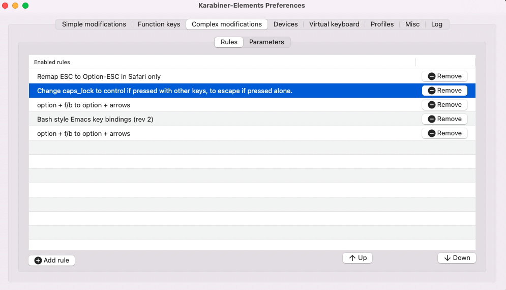

# Table of Contents

1.  [About](#orge6a7e44)
2.  [How to install](#orgd3f671d)
    1.  [Install emacs](#org719ed70)
    2.  [Clone project](#org0cd0a5c)
    3.  [Doom Install](#org5caec9d)
3.  [How to update](#org97fbf6b)
4.  [Private setting](#orgce89573)
5.  [Neoemacs modules](#org5564a56)
    1.  [Java module](#orgccd7642)
    2.  [Dap-java Usage](#orgf3265d4)
    3.  [Ejc-sql Usage](#org4d0323d)
    4.  [Restclient](#org69770b9)
    5.  [Company box customize](#org0b9c3fb)
    6.  [Eredis Usage](#org5267d97)
    7.  [Bookmark](#org5c547ce)
    8.  [Rime Usage](#org40d3c06)
    9.  [Libvterm Usage](#orgae34c1d)
    10. [Elpa Offline](#org3bb5f9c)
    11. [FZF Config](#org4204cd1)
6.  [Org mode](#orgdf72c02)
    1.  [Doom org style](#org98a1658)
    2.  [Dot sketchviz](#org79ff888)
    3.  [Latex PDF setting](#org89f4883)
7.  [Alfred](#org5a2a175)
8.  [Questions](#org4568a8c)
    1.  [install ffmpeg](#org900f9e2)
    2.  [how to install all-the-icons?](#org7df5226)
    3.  [how to install rime ?](#org04ecf37)
    4.  [how to install vterm?](#org4116cff)
    5.  [lsp-springboot](#org977a004)
    6.  [useful key setting](#org455c2fa)
    7.  [why message showed could not load undo-tree history](#org8493af9)
    8.  [File mode specification error: (file-missing Doing vfork No such file or directory)](#org39b65f1)
    9.  [image dir](#orga53bf74)
9.  [About Logo](#orgb3dcd9b)
10. [Dependencies](#org63041ed)

  

# About

Neo emacs is a configuration framework for GNU Emacs which is based on doom emacs and focuses on the java web application coding environment. Neo emacs has the following features:  

-   Code completion: Lsp-java supports maven and gradle project.
-   Program debugging: Dap-java supports program debugging.
-   Http client: Rest-client is a tool to manually explore and test HTTP REST webservices just like Postman.
-   SQL client: Ejc-sql turns Emacs into a simple SQL client which supports various databases.
-   Redis client: Eredis Non-blocking Redis client with focus on performance and robustness.
-   Terminal emulator: Emacs-libvterm (vterm) is fully-fledged terminal emulator inside GNU Emacs based on libvterm.
-   Knowledge management system: Org-roam borrows principles from the Zettelkasten method, providing a solution for non-hierarchical note-taking.
-   [onlinedoc](http://1.117.167.195/doc/neo-emacs.html)

# How to install

## Install emacs

There have many emacs distribution,just choose one and install it.  

-   [gnu-emacs](https://www.gnu.org/software/emacs/) is the official emacs client.
-   [emacs-plus](https://github.com/d12frosted/homebrew-emacs-plus) which I used for a long time.
-   Building Emacs form source  
    
    building emacs with with source code  
    
        1    git clone git://git.savannah.gnu.org/emacs.git
        2    cd emacs
        3    git checkout emacs-28
        4    brew install  libxml2
        5    make configure
        6    ./configure --with-native-compilation --with-modern-papirus-icon --with-no-titlebar
        7    make -j4
        8    make install
        9    open nextstep/Emacs.app
-   EmacsPorts  
    
    EmacsPorts is the best choice to run NeoEmcas on macos.  
    
        brew install emacs-mac --with-natural-title-bar --with-mac-metal
        --with-librsvg --with-starter --with-emacs-big-sur-icon --with-native-comp
        defaults write org.gnu.Emacs TransparentTitleBar DARK
        defaults write org.gnu.Emacs HideDocumentIcon kES

After emacs installation, set environment variables which names EMACS ,this depends on your emacs exec path.  

    export EMACS=/Applications/Emacs.app/Contents/MacOS/Emacs,

## Clone project

clone doom-emacs and neo-emacs from github.  

    git clone --depth 1 https://github.com/doomemacs/doomemacs ~/.emacs.d
    git clone --depth 1 https://github.com/vanniuner/neo-emacs.git ~/.doom.d/

## Doom Install

Set up a vpn if you need it.  

    export http_proxy="ip:port"
    export https_proxy="ip:port"

Set your emacs cmd for doom install.  

    export EMACS= $YOUR EMACS CMD PATH$

At last run below, this will take few minutes. And it depends on the quality of your network.  

    ~/.emacs.doom/bin/doom install

# How to update

    export EMACS=/Applications/Emacs.app/Contents/MacOS/EMACS
    sh ~/.emacs.d/bin/doom upgrade
    sh ~/.emacs.d/bin/doom install
    sh ~/.emacs.d/bin/doom sync

# Private setting

Customize your private setting config in the config.el ;  
kse `setq`  

    (setq fd-exec-path                   "/opt/homebrew/bin/fd"
          rg-exec-path                   "/opt/homebrew/bin/rg")

<table border="2" cellspacing="0" cellpadding="6" rules="groups" frame="hsides">
<caption class="t-bottom">Table 1: neo-emacs basic setting</caption>

<colgroup>
<col  class="org-left" />

<col  class="org-left" />

<col  class="org-left" />
</colgroup>
<tbody>
<tr>
<td class="org-left">emacs-module-root</td>
<td class="org-left">/opt/homebrew/opt/emacs-plus@28/include</td>
<td class="org-left">emcas module root</td>
</tr>

<tr>
<td class="org-left">rg-exec-path</td>
<td class="org-left">&ldquo;/opt/homebrew/bin/rg&rdquo;</td>
<td class="org-left">rg            exec path</td>
</tr>

<tr>
<td class="org-left">fd-exec-path</td>
<td class="org-left">&ldquo;/opt/homebrew/bin/fd&rdquo;</td>
<td class="org-left">fd            exec path</td>
</tr>

<tr>
<td class="org-left">dot-exec-path</td>
<td class="org-left">&ldquo;/opt/homebrew/bin/dot&rdquo;</td>
<td class="org-left">dot           exec path</td>
</tr>

<tr>
<td class="org-left">pdflatex-exec-path</td>
<td class="org-left">&ldquo;/Library/TeX/texbin/pdflatex&rdquo;</td>
<td class="org-left">pdflatex      exec path</td>
</tr>

<tr>
<td class="org-left">node-bin-dir</td>
<td class="org-left">&ldquo;~/node-v16.14.0/bin&rdquo;</td>
<td class="org-left">node exec path</td>
</tr>

<tr>
<td class="org-left">lsp-java-jdt-download-url</td>
<td class="org-left"><a href="http://1.117.167.195/download">http://1.117.167.195/download</a></td>
<td class="org-left">jdt-server URL</td>
</tr>

<tr>
<td class="org-left">lsp-java-java-path</td>
<td class="org-left">&#xa0;</td>
<td class="org-left">java11        exec path</td>
</tr>

<tr>
<td class="org-left">lsp-maven-path</td>
<td class="org-left">&ldquo;~/.m2/settings.xml&rdquo;</td>
<td class="org-left">maven setting path</td>
</tr>

<tr>
<td class="org-left">org-directory</td>
<td class="org-left">&ldquo;~/org/&rdquo;</td>
<td class="org-left">org           root path</td>
</tr>

<tr>
<td class="org-left">org-roam-directory</td>
<td class="org-left">&ldquo;~/org/org-roam&rdquo;</td>
<td class="org-left">org roam      root path</td>
</tr>

<tr>
<td class="org-left">display-line-numbers-type</td>
<td class="org-left">nil</td>
<td class="org-left">show line number</td>
</tr>

<tr>
<td class="org-left">rime-user-data-dir</td>
<td class="org-left">&ldquo;~/Library/Rime/&rdquo;</td>
<td class="org-left">rime config input</td>
</tr>

<tr>
<td class="org-left">rime-librime-root</td>
<td class="org-left">&ldquo;~/.doom.d/myconfig/rime-macos/dist&rdquo;</td>
<td class="org-left">emacs-rime/blob/master/</td>
</tr>
</tbody>
</table>

# Neoemacs modules

## Java module

Neo-Emacs will automatically download the jdtls from \`lsp-java-jdt-download-url\`, and now it&rsquo;s located at [jdt-language-server-1.22.0](https://www.eclipse.org/downloads/download.php?file=/jdtls/milestones/1.22.0/jdt-language-server-1.22.0-202304131553.tar.gz).After that you could use all the features powered by eclipse.  

-   Generate eclipse files  
    Execute mvn command for generate eclipse .project & .classpath files on your project root path.  
    
        mvn eclipse:clean eclipse:eclipse
-   Support projectlombok plugin  
    There have a default lombok.jar in `doom-user-dir/neoemacs` which you could replace by yourself.  
    
        (setq  lombok-jar-path (expand-file-name (concat doom-user-dir "neoemacs/lombok.jar")
-   Shotcuts/Key binding  
    
    <table border="2" cellspacing="0" cellpadding="6" rules="groups" frame="hsides">
    <caption class="t-bottom">Table 2: java mode key binding</caption>
    
    <colgroup>
    <col  class="org-left" />
    
    <col  class="org-left" />
    
    <col  class="org-left" />
    </colgroup>
    <tbody>
    <tr>
    <td class="org-left">KEY</td>
    <td class="org-left">FUNCTION</td>
    <td class="org-left">DESCRIPTION</td>
    </tr>
    
    
    <tr>
    <td class="org-left">SPC c i</td>
    <td class="org-left">find-implementations</td>
    <td class="org-left">find where sub class definition</td>
    </tr>
    
    
    <tr>
    <td class="org-left">SPC c I</td>
    <td class="org-left">lsp-java-open-super-implementation</td>
    <td class="org-left">find where sub class definition</td>
    </tr>
    
    
    <tr>
    <td class="org-left">SPC t e</td>
    <td class="org-left">lsp-treemacs-java-deps-list</td>
    <td class="org-left">find projects referenced libs</td>
    </tr>
    
    
    <tr>
    <td class="org-left">SPC c f</td>
    <td class="org-left">formart buffer/region</td>
    <td class="org-left">goto type definition</td>
    </tr>
    
    
    <tr>
    <td class="org-left">SPC c a</td>
    <td class="org-left">lsp-execute-code-action</td>
    <td class="org-left">code action</td>
    </tr>
    
    
    <tr>
    <td class="org-left">SPC c d</td>
    <td class="org-left">lsp-jump-definition</td>
    <td class="org-left">jump to where symbol definition</td>
    </tr>
    
    
    <tr>
    <td class="org-left">SPC c D</td>
    <td class="org-left">lsp-jump-reference</td>
    <td class="org-left">jump to where symbol referenced</td>
    </tr>
    
    
    <tr>
    <td class="org-left">SPC c o</td>
    <td class="org-left">lsp-java-organize-imports</td>
    <td class="org-left">import require package</td>
    </tr>
    </tbody>
    </table>
-   HotSwarp  
    [hotswapagent](http://hotswapagent.org/mydoc_configuration.html) ，a relacement of jrebel  
    -   DCEVM  
        1.  [download](https://github.com/JetBrains/JetBrainsRuntime/releases?page=6)  [dcevm](https://ssw.jku.at/dcevm/)
        2.  use command run your application `dcevmjava -jar app.jar`
    -   Hotswapagent  
        1.  download lastest hotswapagent [here](https://github.com/HotswapProjects/HotswapAgent/releases)
        2.  replace hotswapagent to $DCEVM\_HOME/lib/hotswap/hotswap-agent.jar
    -   Startup  
        1.  hotswap-agent config.  
            [hotswap-agent.properties](https://github.com/HotswapProjects/HotswapAgent/blob/master/hotswap-agent-core/src/main/resources/hotswap-agent.properties) hotswap-agent.properties place to project&rsquo;s resources directory.  
            
                extraClasspath=target/classes;../longda-archetype-dao/target/classes
                watchResources=../longda-archetype-dao/src/main/resources
                webappDir=
                disabledPlugins=Hibernate, Hibernate3JPA, Hibernate3, Jersey1, Jersey2, MyFaces,
                Mojarra, Omnifaces, ELResolver, WildFlyELResolver, OsgiEquinox, Owb, Proxy, Weld,
                JBossModules, ResteasyRegistry, Deltaspike, GlassFish, Vaadin, Wicket, CxfJAXRS,
                FreeMarker, Undertow
                autoHotswap=true
                spring.basePackagePrefix=pkg.
                LOGGER=info
        2.  startup with dcevm  
            use dcevm jar run your application which locate at $DCEVM\_HOME/bin/java.  
            add java startup parameters for HotswapAgent.  
            
                $dcevmjava -XX:HotswapAgent=fatjar -Xlog:redefine+class*=info -jar app.jar
-   How to upgrade jdtls  
    1.  Customization your own eclipse jdtls project version by replace it&rsquo;s binary pacage.
    2.  Download the lastest jdt-language-server from <https://download.eclipse.org/jdtls/milestones>.
    3.  Replace file to ~/.emacs.d/.local/etc/lsp/eclipse.jdt.ls.

1.  TODO most wanted

    1.  coding
    
        1.  eldoc [lsp-java/issues/432](https://github.com/emacs-lsp/lsp-java/issues/432)

## TODO Dap-java Usage

I do not use debug for years. So be careful the documentation maybe outdated.I think you need customization by yourself.  

-   Config the debug host and port, add file $usr\_private\_dir/dap-java-config.el.
-   Use \`(setq user-private-dir &ldquo;$usr\_private\_dir/dap-java-config.el&rdquo; )\` make it effective.  
    
        1  (dap-register-debug-template
        2   "user-service"
        3   (list :name "Java Attach"
        4         :type "java"
        5         :request "attach"
        6         :projectName "user-service"
        7         :hostName "127.0.0.1"
        8         :port 1044))
-   key binding  
    
    <table border="2" cellspacing="0" cellpadding="6" rules="groups" frame="hsides">
    
    
    <colgroup>
    <col  class="org-left" />
    
    <col  class="org-left" />
    
    <col  class="org-left" />
    </colgroup>
    <tbody>
    <tr>
    <td class="org-left">KEY</td>
    <td class="org-left">FUNCTION</td>
    <td class="org-left">DESCRIPTION</td>
    </tr>
    
    
    <tr>
    <td class="org-left">, n</td>
    <td class="org-left">dap-next</td>
    <td class="org-left">Breakpoint next</td>
    </tr>
    
    
    <tr>
    <td class="org-left">, b</td>
    <td class="org-left">dap-breakpoint-toggle</td>
    <td class="org-left">&#xa0;</td>
    </tr>
    
    
    <tr>
    <td class="org-left">, c</td>
    <td class="org-left">dap-continue</td>
    <td class="org-left">&#xa0;</td>
    </tr>
    
    
    <tr>
    <td class="org-left">, r</td>
    <td class="org-left">dap-eval-region</td>
    <td class="org-left">&#xa0;</td>
    </tr>
    
    
    <tr>
    <td class="org-left">, a</td>
    <td class="org-left">dap-eval-thing-at-point</td>
    <td class="org-left">&#xa0;</td>
    </tr>
    
    
    <tr>
    <td class="org-left">, d</td>
    <td class="org-left">dap-debug</td>
    <td class="org-left">&#xa0;</td>
    </tr>
    
    
    <tr>
    <td class="org-left">, u</td>
    <td class="org-left">dap-ui-repl</td>
    <td class="org-left">&#xa0;</td>
    </tr>
    </tbody>
    </table>

## Ejc-sql Usage

-   The privacy configuration  
    In here you could save any connections in your setting config.  
    But where should the setting located especially for our Emacs config project with a public github repository? There have a privacy path which is excluded in the public repository named **user-private-dir**, You could config your connection&rsquo;s account/password here for safely.
-   Config your particular db connection  
    
        (use-package ejc-sql
            :commands ejc-sql-mode ejc-connect
            :config
            (setq clomacs-httpd-default-port 18090)
            (ejc-create-connection "connection-name"
                                   :classpath      "~/.m2/repository/mysql/mysql-connector-java/8.0.17/
                         mysql-connector-java-8.0.17.jar"
                                   :connection-uri "jdbc:mysql://localhost/user?useSSL=false&user=root&password=pwd"
                                   :separator      "</?\.*>" )
            )
        (provide 'db-work)
-   Write Sql file  
    Before try to use ejc sql, firstly create a sql file which named with a suffix **.sql**, cause emacs will turn on the sql minor mode so that ejc-sql could works well. And then use `SPC e c` to connect a particular database which you have configurated. Emacs will popup a minibuffer listing candidates which show you the **connection-name**.  
    Secondarily, write your testing sql content which surrounded by a tag, cause we have configurated **:separator** by a syntax meaning tag in order to execute a single sql rather than to choose it.For sure you could make any comment with the tag&rsquo;s schema.  
    Further more, you could use delimiter sign for batch execution. the delimiter could customization by any character.  
    Finnaly, use `C-c C-c` to execute it. It&rsquo;s just execute the content which surrounded by a tag in your cusor.  
    
        1  <SELECT name='select all org'>
        2  SELECT * FROM TABLE_ORG
        3  </SELECT>
        4  
        5  <SELECT>
        6  delimiter ;
        7  COMMENT ON COLUMN TABLE_ORG.PROJECT_CODE IS '项目编码';
        8  COMMENT ON COLUMN TABLE_ORG.PERIOD IS '期间';
        9  </SELECT>
-   key binding  
    
    <table border="2" cellspacing="0" cellpadding="6" rules="groups" frame="hsides">
    
    
    <colgroup>
    <col  class="org-left" />
    
    <col  class="org-left" />
    
    <col  class="org-left" />
    </colgroup>
    <tbody>
    <tr>
    <td class="org-left">KEY</td>
    <td class="org-left">FUNCTION</td>
    <td class="org-left">description</td>
    </tr>
    
    
    <tr>
    <td class="org-left">SPC e c</td>
    <td class="org-left">ejc-connection</td>
    <td class="org-left">choose connection with ivy</td>
    </tr>
    
    
    <tr>
    <td class="org-left">C-c C-c</td>
    <td class="org-left">ejc-execute</td>
    <td class="org-left">execute the sql</td>
    </tr>
    </tbody>
    </table>

## Restclient

Restclient provide a test suite for HTTP REST in Emacs.The official repository here [restclient.el](https://github.com/pashky/restclient.el).  
Yea, a pretty old old project.Fortunately doom emacs have integrated it.We just need open it with `(rest +jq)`.  
**+jq** makes restclient have the ability to parse a particular response which Content-Type equalable application/json.  
The amazing feature is restclient support set variables or make a part of response being a variables which one could as a request part for another HTTP REST.  

Here we take the value from results as a variables which named count.  

    GET https://www.zhihu.com/api/v3/oauth/sms/supported_countries
    -> jq-set-var :count .count

> Only **jq-set-var** could works when the content-type equal to application/json MIME type  

Fortunately we have solution for other mime type, it&rsquo;s restclient-set-var, you could use elisp to parse the response;  

    GET https://www.baidu.com/sugrec
    -> run-hook (restclient-set-var ":queryid" (cdr (assq 'queryid (json-read))))
    Content-Type: application/x-www-form-urlencoded; charset=utf-8

About the variables infomation in current buffer, we could use `C-c Tab` to show them.  

## Company box customize

-   use \`M-x all-the-icons-material\` for checking icon
-   company-icon icon config file: ~/.emacs.d/modules/completion/company/config.el

## Eredis Usage

1.  connect setting

    **M-x** ielm  
    
        (use-package eredis)
        (setq rp (eredis-connect "your redis ip" 6379))
        (eredis-auth "pwd" rp)

2.  send redis command on org mode

    key binding C-c C-c  
    
        ;; select database
        (eredis-select 1)
        ;; query center-bpm:flow-list-count
        (eredis-get "center-bpm:flow-list-count")
        (eredis-org-table-from-keys '("center-bpm:flow-list-count" ))
    
    <table border="2" cellspacing="0" cellpadding="6" rules="groups" frame="hsides">
    
    
    <colgroup>
    <col  class="org-left" />
    
    <col  class="org-right" />
    
    <col  class="org-left" />
    </colgroup>
    <tbody>
    <tr>
    <td class="org-left">Key</td>
    <td class="org-right">Value(s)</td>
    <td class="org-left">Type</td>
    </tr>
    
    
    <tr>
    <td class="org-left">center-bpm:flow-list-count</td>
    <td class="org-right">1</td>
    <td class="org-left">string</td>
    </tr>
    </tbody>
    </table>

## Bookmark

-   the bookmark file location :~/.emacs.d/.local/etc/bookmarks

    (setq bookmark-default-file "~/org/org-roam/command/doom/config/bookmark")

## Rime Usage

-   <https://github.com/DogLooksGood/emacs-rime> supply this plugin.
-   <https://github.com/rime/plum> for more infomation.
-   some rime input method config at .doom.d/myconfig/rime-config.
-   &rsquo;emacs-module.h&rsquo; file not found  
    
        lib.c:23:10: fatal error: 'emacs-module.h' file not found
          #include <emacs-module.h>
                  ^~~~~~~~~~~~~~~~
    
        cp /opt/homebrew/opt/emacs-plus@29/include/emacs-module.h /Users/van/.doom.d/neoemacs/rime-macos/dist/include

## Libvterm Usage

-   Configuration  
    
    -   fish shell configuration
    
        function vterm_printf;
            if begin; [  -n "$TMUX" ]  ; and  string match -q -r "screen|tmux" "$TERM"; end
                # tell tmux to pass the escape sequences through
                printf "\ePtmux;\e\e]%s\007\e\\" "$argv"
            else if string match -q -- "screen*" "$TERM"
                # GNU screen (screen, screen-256color, screen-256color-bce)
                printf "\eP\e]%s\007\e\\" "$argv"
            else
                printf "\e]%s\e\\" "$argv"
            end
        end
        if [ "$INSIDE_EMACS" = 'vterm' ]
            function clear
                vterm_printf "51;Evterm-clear-scrollback";
                tput clear;
            end
        end
-   Ubuntu  
    
        sudo apt install cmake
        sudo apt install libtool-bin
-   MacOs  
    
        sudo brew install cmake libtool
-   Key Binding  
    
    <table border="2" cellspacing="0" cellpadding="6" rules="groups" frame="hsides">
    
    
    <colgroup>
    <col  class="org-left" />
    
    <col  class="org-left" />
    
    <col  class="org-left" />
    </colgroup>
    <tbody>
    <tr>
    <td class="org-left">KEY</td>
    <td class="org-left">FUNCTION</td>
    <td class="org-left">DESCRIPTION</td>
    </tr>
    
    
    <tr>
    <td class="org-left">SPC v v</td>
    <td class="org-left">projectile-run-vterm</td>
    <td class="org-left">open vterm window base on the project root path</td>
    </tr>
    
    
    <tr>
    <td class="org-left">SPC v p</td>
    <td class="org-left">vterm-send-start</td>
    <td class="org-left">enable vterm screen roll</td>
    </tr>
    
    
    <tr>
    <td class="org-left">SPC v s</td>
    <td class="org-left">vterm-send-stop</td>
    <td class="org-left">disable vterm screen roll</td>
    </tr>
    </tbody>
    </table>

## Elpa Offline

rsync -avz rsync://mirrors.tuna.tsinghua.edu.cn/elpa ~/soft/emacs-elpa  

    (setq configuration-layer--elpa-archives
          '(("melpa-cn" . "/soft/emacs-elpa/melpa/")
            ("org-cn"   . "/soft/emacs-elpa/org/")
            ("gnu-cn"   . "/soft/emacs-elpa/gnu/")
            ("marmalade-cn"   . "/soft/emacs-elpa//marmalade/")))

## FZF Config

1.  fish config

        set -x FZF_DEFAULT_OPTS "--preview-window 'right:57%'
            --preview 'bat --style=numbers --line-range :300 {}'
            --bind ctrl-y:preview-up,ctrl-e:preview-down,ctrl-b:preview
            -page-up,ctrl-f:preview-page-down,ctrl-u:preview-half-page-
            up,ctrl-d:preview-half-page-down,shift-up:preview-top,shift
            -down:preview-bottom,alt-up:half-page-up,
            alt-down:half-page-down"
        set -x FZF_DEFAULT_COMMAND  'fd --type f --hidden --follow
            --exclude ".git" .
            ".idea" . ".vscode" . "node_modules" .
            "build" . "target" . "classes" . "out" . "class" .
            "*.svg" . "*.puml" . "*.orgids" . "*.css" . "*.DS_Store" '

2.  how to ignore files

    -   add ~/.fdignore  
        
            .DS_Store
            .orgids
            *.svg
            *.puml
            *.css
            *.class
            *.attach
            *.~undo-tree~
            crpt

# Org mode

## Doom org style

A vairty of template about org mode code which one referenced the doom doc style [Preview](http://1.117.167.195/doc/doomorgstyle.html)  
How to use? <https://github.com/vanniuner/doom-org-style>  

## Dot sketchviz

    cd ~/.doom.d/neoemacs/sketchviz/sketch.js
    npm install --save roughjs
    npm i jsdom

-   usage  
    
    

## Latex PDF setting

1.  install [mactex](https://tug.org/mactex/)
2.  put [elegantpaper.cls](https://github.com/ElegantLaTeX/ElegantPaper/blob/master/elegantpaper.cls) under the org file dir
3.  add the code in the head of your org mode file  
    
        #+LATEX_COMPILER: xelatex
        #+LATEX_CLASS: elegantpaper
        #+OPTIONS: prop:t

4.  [more info](https://www.sheerwill.live/posts/main/20220723211325-vanilla_emacs_with_purcell/)

# Alfred

Alfred repeat item  
perference -> Advanced -> Rebuild macOS Metadata.  
alfred -> reload  

# Questions

## install ffmpeg

-   brew install ffmpeg

## how to install all-the-icons?

-   M-x install-package all-the-icons
-   M-x all-the-icons-install-fonts

## how to install rime ?

-   M-x install-package rime

unzip rime-1.5.3-osx.zip -d ~/.emacs.d/librime  

## how to install vterm?

    cd .emacs.d/.local/straight/build/vterm/
    mkdir -p build
    # install cmake and libtool-bin
    brew install cmake, brew install libtool
    mkdir -p build
    cd build
    cmake ..
    make

## lsp-springboot

    mvn -Djdt.js.server.root=/Users/van/.emacs.d/.local/etc/.cache/
    lsp/eclipse.jdt.ls/server/ -Djunit.runner.root=
    /Users/van/.emacs.d/.local/etc/eclipse.jdt.ls/test-runner/
    -Djunit.runner.fileName=junit-platform-console-standalone.jar
    -Djava.debug.root=/Users/van/.emacs.d/.local/etc/.cache/lsp/
    eclipse.jdt.ls/server/bundles clean package
    -Djdt.download.url=http://download.eclipse.org/jdtls/snapshots/
    jdt-language-server-latest.tar.gz -f lsp-java-server-build.pom

## useful key setting

-   Change caps\_lock to control if pressed with other keys, to escape if pressed alone.  
    

## why message showed could not load undo-tree history

    brew install watchexec

## File mode specification error: (file-missing Doing vfork No such file or directory)

When open a Java file this error happen.  
It&rsquo;s because the environment do not content on your GUI Emacs.  
It works well on your termianl environment with start Emacs by Emacs -nw.  
So the solution is change the execution file with the below shell script on MacOs  

-   emacs-plus cp to application dir

    cp -rf /opt/homebrew/opt/emacs-plus@28/Emacs.app/ /Applications/
    mv /Applications/Emacs.app/Contents/MacOS/Emacs Emacs.old

-   /Applications/Emacs.app/Contents/MacOS/Emacs

    #!/usr/local/bin/fish
    /Applications/Emacs.app/Contents/MacOS/Emacs.old

## image dir

    ln -s ~/org/org-roam/image any_where/image

# About Logo

edit with: [online-ps-editor](https://ps.gaoding.com/#/), [psd file](./logo.psd)  

# Dependencies

<https://github.com/hlissner/doom-emacs/blob/master/docs/getting_started.org>  

<https://github.com/BurntSushi/ripgrep>  

<https://github.com/junegunn/fzf>  

<https://github.com/kostafey/ejc-sql>  

<https://leiningen.org/>  

<https://plantuml.com/>  

<https://github.com/emacs-lsp/lsp-java>  

<https://projectlombok.org/>  

<https://github.com/DogLooksGood/emacs-rime>  

<https://github.com/be5invis/Sarasa-Gothic>  

<https://github.com/akicho8/string-inflection>  

<https://raw.githubusercontent.com/alibaba/p3c/master/p3c-formatter/eclipse-codestyle.xml>  

<https://www.tug.org/mactex/>  

