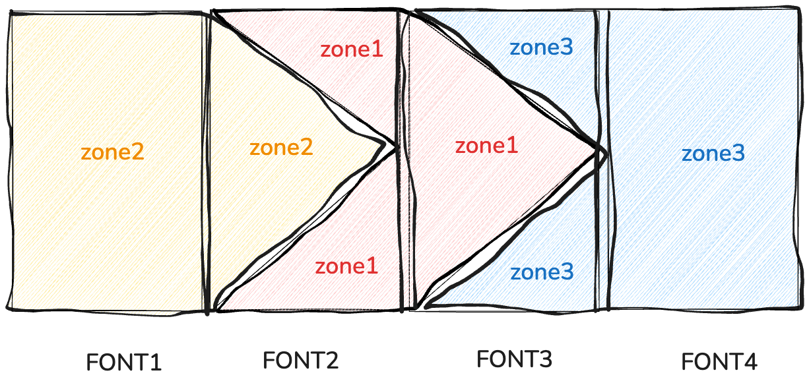

# Table of Contents

1.  [use powerline](#org3590bc3)

# use powerline

Use powerline project separably style should import powerline package.  

    (package! powerline           )

  
As you see, in fact power line just use special character to implement arrow style.It&rsquo;s a bit complicated cause there used three color in four font and spread over three zone.font 1 and 4 is your modeline common segment which stands for evil state or buffer name etc.It&rsquo;s essential that make sure segment&rsquo;s background color correspond to the powerline&rsquo;s color.Understand that you could custom your powerline separable symbol easily.  
Here config the evil state and powerline arrow as you know we configed font 2 and 3. font 1 is the real evil state content. Font 4 is the next message.  

    (doom-modeline-def-segment powerline-evil-right
    "Insert a Powerline separator into the Doom Modeline."
    (let* ((separator 'arrow) ;; 获取当前分隔符
      (separator-fn
        (intern
        (format "powerline-%s-%s" separator
        (cdr powerline-default-separator-dir))))) ;; 获取分隔符函数
          (propertize " " 'display (funcall separator-fn
        (when (doom-modeline--active)
        (if (eq evil-state 'normal) 'powerline-evil-normal-state
            (if (eq evil-state 'insert) 'powerline-evil-insert-state
            (if (eq evil-state 'visual) 'powerline-evil-visual-state
            (if (eq evil-state 'replace) 'powerline-evil-replace-state
            (if (eq evil-state 'motion) 'powerline-evil-motion-state)
            'powerline-evil-normal-state))))) 'org-agenda-clocking ))))
    
    (doom-modeline-def-segment powerline-evil-right-arrow
    "Insert a Powerline separator into the Doom Modeline."
    (let* ((separator 'arrow) ;; 获取当前分隔符
       (separator-fn
       (intern (format "powerline-%s-%s" separator
       (cdr powerline-default-separator-dir ))))) ;; 获取分隔符函数
       (propertize " " 'display (funcall separator-fn 'org-agenda-clocking 'mode-line ))))

> make a left arrow use car (car powerline-default-separator-dir )  
> make a right arrow use cdr (cdr powerline-default-separator-dir )  

final effect  
  

